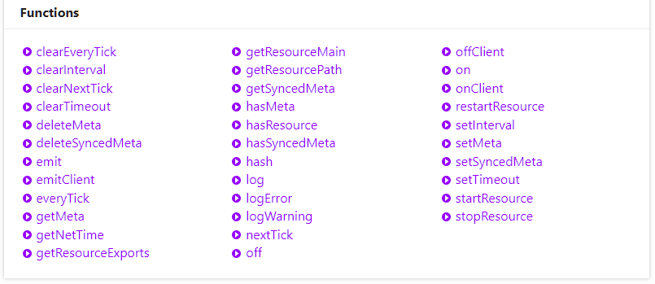

# Einleitung in die alt:V API

Die API ist das Informationsbeschaffungdesign, welches du benötigst und benutzen solltest, um Funktionalitäten durch das schreiben von Code in alt:V zu realisiren.

-   [https://altmp.github.io/altv-typings/](https://altmp.github.io/altv-typings/)

## Navigation durch die API

Wenn du die API liest gibt es zwei Sektionen. **(Klicke auf den obigen Link)**

-   alt-server

    -   Beinhaltet alle serverseitigen Funktionalitäten.

-   alt-client

    -   Beinhaltet alle clientseitigen Funktionalitäten.

    -   Benutzt oft native Funktionen (natives), also originale Funktionen von GTA.

    -   Betrifft immer nur das Spiel des jeweiligen Spielers.

## Das Lesen der API

Wenn du dir die API anschaust, siehst du, dass alle Parameter und deren Datentypen für Funktionen und Klassen angegeben sind.

Das folgende Beispiel zeigt die `alt.on` Funktion.

```ts
on(eventName: "playerConnect", listener: (player: Player) => void): void
```

Wenn du dies zum ersten Mal siehst, könnte es ein bisschen verwirrend auf dich wirken.

-   `on` bedeutet, dass hier auf das drauffolgende Event gewartet, also gehört, wird.
-   Der Eventname heißt `playerConnect`
-   Der zweite Parameter ist die Funktion, welche ausgeführt wird, wenn das Event stattgefunden hat. Diese liefert eine Variable mit dem Datentyp `alt.Player`.
    -   Du kannst auf den Player drücken, um zu sehen, welche Eigenschaften dieser aufweist.
    -   Manche Eigenschaften heißen z.B `name`, `ip`, etc.
-   `:void` bedeutet, dass diese Funktion nichts zurückgibt.

Hier ist das selbe Event und dessen Funktion in einem Beispiel:

```js
alt.on('playerConnect', handlePlayerConnect);

function handlePlayerConnect(player) {
    alt.log(`${player.name} connected to the server.`);
}
```

## Benutzung der API

Standardmäßig siehst du ein paar unterschiedliche Datentypen von Variablen, Funktionen und Klassen.

Lass uns darüber reden, was jeder Typ davon bedeutet und wie er im Code aussieht.

### Funktionen

Funktionen funktionieren stets wie Funktionen (Lol) und die API hat eine Sektion für sie.



Hier ist ein Beispiel, wie eine der obigen Funktionen im Code aussieht.

```js
alt.setTimeout(() => {
    alt.log(`Hello. This triggered after 5 seconds.`);
}, 5000);
```

### Klassen

Klassen funktionieren wie normale JavaScript Klassen. Der Aufruf dieser, ist nur davon abhängig wie du dein `alt-server` oder `alt-client` importiert hast.

Gehen wir hier mal davon aus, dass alles das Prefix `alt` benötigt.


Sei dir bewusst, dass nicht alle Klassen aufrufbar sind oder erstellt werden können.

Nun ein Beispiel, wie man manche der Klassen benutzen kann.

```js
const pos = new alt.Vector3(0, 0, 0);
const vehicle = new alt.Vehicle('infernus', pos.x, pos.y, pos.z, 0, 0, 0);
const shape = new alt.ColshapeCylinder(pos.x, pos.y, pos.z, 5, 10);
```

### Eigenschaften

Eigenschaften existieren nur in einem Klassenobjekt.

Sie sind manchmal nur lesbar, du musst sie also nicht immer selber setzen.

Hier ist ein Beispiel für ein Fahrzeug:

```js
const vehicle = new alt.Vehicle('infernus', 0, 0, 0, 0, 0, 0);

if (vehicle.engineOn === false) {
    vehicle.engineOn = true;
}
```

### Methoden

Eine Methode existiert nur in einem Klassenobjekt. Sie sind aufrufbar durch Vererbung.

```js
const vehicle = new alt.Vehicle('infernus', 0, 0, 0, 0, 0, 0);
const result = vehicle.getDoorState(0);
vehicle.setArmoredWindowHealth(0, 100);
```
