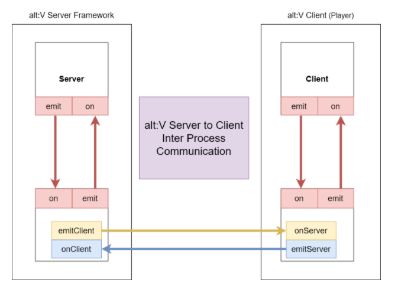

# Events

Events work in a very specific way and understanding their communication is very important.

Server can talk to any client.
Client may only talk to WebViews and the Server.

A client **CANNOT** talk to another client.

| Function Name  | Description                                                                                |
| -------------- | ------------------------------------------------------------------------------------------ |
| alt.emit       | Emit an event on server or client side. Only recieved on the side it was emitted from.     |
| alt.on         | Recieves an event. Server only recieves server events. Client only recieves client events. |
| alt.onServer   | Recieves an event emitted from the server on client-side. Triggered with `alt.emitClient`. |
| alt.emitClient | Emit an event to a specific client that they recieve with `alt.onServer`.                  |
| alt.onClient   | Recieves an event emitted from the client on server-side. Triggered with `alt.emitServer`. |
| alt.emitClient | Emit an event to the server that is recieved with `alt.onClient`.                          |

## IPC Diagram



## Server to Client

The server may only emit data to the client-side with emitClient which requires a Player.
However, a player can also be substituted for null which will emit to all players.

**Server Side**

```js
alt.on('playerConnect', player => {
    alt.emitClient(player, 'sayHello');
});
```

**Client Side**

```js
alt.onServer('sayHello', () => {
    alt.log('Hello from server.');
});
```

## Client to Server

The client may only emit data to the server-side with emitServer.
The server-side onServer event will automatically receive a Player in their event handler.

**Client Side**

```js
alt.on('connectionComplete', () => {
    alt.emitServer('sayHello');
});
```

**Server Side**

```js
alt.onClient('sayHello', player => {
    alt.log(`${player.name} is saying hello`);
});
```

## Server Resource to Server Resource

The server may only communicate with itself with on and emit functions.
The client may only communicate with itself with on and emit functions.
They speak across resources as well.

**Server Side**

```js
alt.emit('hello', 'this is a message');

alt.on('hello', msg => {
    alt.log(msg);
});
```

## Client Resource to Client Resource

**Client Side**

```js
alt.emit('hello', 'this is a message');

alt.on('hello', msg => {
    alt.log(msg);
});
```

## Client to WebView and Back

**Note:** Resource in the HTTP address refers to the resource that you are currently writing code for.

**Client Side**

```js
const webview = new alt.WebView('http://resource/client/html/index.html');
webview.on('test2', handleFromWebview);

function handleFromWebview(msg) {
    alt.log(msg);
}

alt.setTimeout(() => {
    webview.emit('test', 'Hello from Client');
}, 500);
```

**Client Side HTML Page**

```html
<html>
    <head>
        <title>Hello World</title>
    </head>
    <body>
        <p>Words</p>
        <script type="text/javascript">
            if ('alt' in window) {
                alt.on('test', msg => {
                    console.log(msg);
                    alt.emit('test2', 'hello from webview');
                });
            }
        </script>
    </body>
</html>
```
