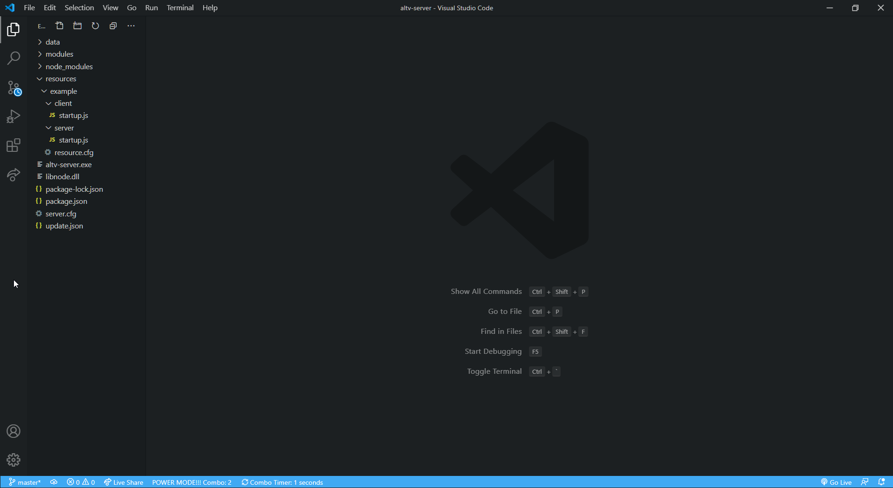
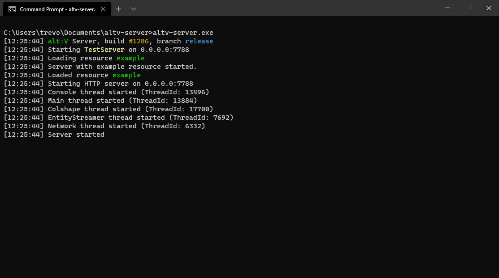
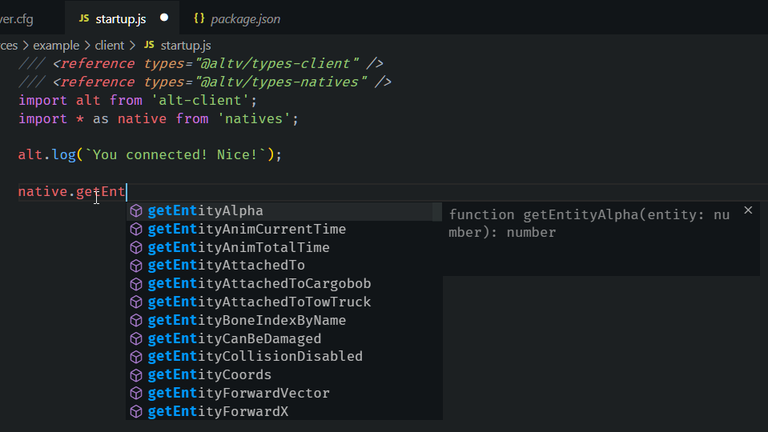

# Installing Server Files

## Prerequisites

Before you begin please install these programs and utilities.

-   [NodeJS 13+](https://nodejs.org/en/download/current/)
-   [Visual Studio Code](https://code.visualstudio.com/download)
-   [GIT](https://git-scm.com/downloads)
-   [alt:V Client](https://altv.mp/#/downloads)

## General Assumptions

This guide will be assuming you will be working in a Windows development environment.

-   You should know how to use a Command Prompt or Powershell
-   You should know how to open Command Prompt or Powershell
-   You should know that you can run .exe files inside of Command Prompt or Powershell
-   You should know very basic JavaScript.

**Important**

All code blocks prefixed with `$` are meant to be ran in Command Prompt or Powershell.

**DO NOT** copy the `$` itself when copying commands.

## Installing altv-pkg

[altv-pkg](https://github.com/stuyk/altv-pkg) is a utility that will quickly allow you to spin up the server binaries on Windows or Linux. This will also give you a base resource for you to work with.

You can install it from a command prompt.

```sh
$ npm install -g altv-pkg
```

If you run into trouble with install global files. Open a **Powershell** with **Administrative** permissions and run the following command.

```sh
$ Set-ExecutionPolicy -Scope CurrentUser -ExecutionPolicy Unrestricted -Force;
```

Verify installion by checking the version.

```sh
$ altv-pkg --version
```

## Using altv-pkg

After installing we'll be downloading the server files.

Create a directory for your server. Then open a Command Prompt in that directory.

```sh
altv-pkg d release
```

This will prompt you for information regarding the gamemode you are creating.

By default the server files and resource files will automatically generate in your current directory.

Follow the on-screen instructions.

-   **N** for Voice
-   **Y** for Example Resource


## Understanding the Files Downloaded

It is important to discuss a few of the files and the general structure created after downloading the server binaries. Here are the files or some general files that should have been downloaded after you run `altv-pkg d release`.

```
|   altv-server.exe
|   libnode.dll
|   package-lock.json
|   package.json
|   server.cfg
|   update.json
|
+---data
|       vehmodels.bin
|       vehmods.bin
|
+---modules
|       js-module.dll
|
\node_modules
\---resources
    \---example
        |   resource.cfg
        |
        +---client
        |       startup.js
        |
        \---server
                startup.js
```

### altv-server.exe

This is your main binary file for running your server. You can run this from command prompt.

```
$ altv-server.exe
```

Use `Ctrl + C` to kill the server.

### package.json

This is where your `node_modules` that you are using will be defined. This is where you install packages that may be used by the server-side. Keep in mind that you cannot use `node_modules` on client-side.

```json
{
    "name": "altv-pkgserver",
    "version": "0.0.0",
    "description": "Don't worry we made this package.json for you.",
    "main": "index.js",
    "scripts": {
        "update": "altv-pkg d release"
    },
    "author": "stuyk",
    "type": "module",
    "prettier": {
        "printWidth": 120,
        "tabWidth": 4,
        "singleQuote": true,
        "bracketSpacing": true
    },
    "devDependencies": {
        "@altv/types-client": "^1.1.1",
        "@altv/types-natives": "^1.1.0",
        "@altv/types-server": "^1.4.2",
        "@altv/types-webview": "^1.0.2"
    }
}
```

Important takeaways from what is defined in this structure.

-   We are using the [Prettier extension for VSCode](https://marketplace.visualstudio.com/items?itemName=esbenp.prettier-vscode)
-   We are using `"type": "module"` to support [ES6 Syntax](https://www.w3schools.com/js/js_es6.asp).
-   We can update our server files by running `$ npm run update` from the base directory.

That's mainly the structure of the package.json and mostly functions like a normal NodeJS project.

### server.cfg

This uses a custom parser for your server's configuration.

```sh
name: "TestServer",
host: "0.0.0.0",
port: 7788,
players: 1024,
#password: "verysecurepassword",
announce: false,
#token: no-token,
gamemode: "Freeroam",
website: "test.com",
language: "en",
description: "test",
debug: false,
modules: [
  "js-module",
],
resources: [
    "example"
],
tags: [
  "customTag1",
  "customTag2",
  "customTag3",
  "customTag4"
]
```

#### password

Password is an optional parameter. Commented out with `#`.

#### token

Token is an optional parameter. Commented out with `#`. You may get a token from the alt:V Discord by messaging one of the bots in the member list.

#### debug

It is recommended to set this `true` in order to work with your server in development mode. This will allow reconnecting to your server if you setup `debug` in your [client configuration](https://wiki.altv.mp/Altv.cfg) as well.

#### resources

This is where you list the folders inside of the `/resources` folder that you want to use. All resources must have a `resource.cfg` inside of their respective folder in order to be loaded as a resource.

Here is the `resource.cfg` from the `/resources/example` folder.

```sh
type: js,
main: server/startup.js,
client-main: client/startup.js,
client-files: [
	client/*
],
deps: []
```

The main entry point for server-side is the `example` resource is `/resources/example/server/startup.js`

The same for client-side except it uses `client` instead of `server`.

### /data

This folder is where we have data files that help us define what vehicle names correspond with what values. These should be downloaded and used automatically.

### /modules

This is where you load special `.dll` or `.so` files for modules that use different languages. ie. C#, Lua, etc. These are usually generated by users who are developing for alt:V. Community made.

### /node_modules

This is where packages you download from NPM are installed. Here is an example on installing the Stanford Javascript Crypto Library from NPM.

```sh
$ npm i sjcl
```

### /resources

Resources is where you create new resources that can be loaded into your `server.cfg`. It is highly recommended that if you are create a very large project that you stick to a single resource for performance reasons and ease of use.

## Opening Up Your Workspace

Open up the folder where you setup your alt:V server in VS:Code.

Should look something like the image below.



You can start writing your code inside of `resources/example/startup.js`.

Make sure your `server.cfg` has `example` inside of the resources section of your `server.cfg`.

```sh
resources: [
  "example"
],
```

Run your server from command line to ensure everything has loaded properly.



## Connecting

You may connect by opening your alt:V Client and using direct connect.

```
127.0.0.1:7788
```

## Server-Side

Server side code should be written in the `server` folder.

You also need to import the `types` for alt:V Server Side.

```js
/// <reference types="@altv/types-server" />
import alt from 'alt-server';

alt.log('test');
```

Your server side should now have auto-completion.


## Client-Side

Client side code should be writtein in the `client` folder.

This is the only section where you can actively use a `native`.

You also need to import the `types` for alt:V Client Side.

```js
/// <reference types="@altv/types-client" />
/// <reference types="@altv/types-natives" />
import alt from 'alt-client';
import * as native from 'natives';

alt.log(`You connected! Nice!`);
```

Your client side should now have auto-completion.


